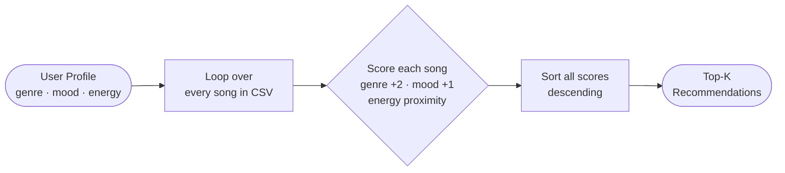

# 🎵 Music Recommender Simulation

## Project Summary

In this project you will build and explain a small music recommender system.

Your goal is to:

- Represent songs and a user "taste profile" as data
- Design a scoring rule that turns that data into recommendations
- Evaluate what your system gets right and wrong
- Reflect on how this mirrors real world AI recommenders

This project builds a content-based music recommender that scores songs against a user taste profile using weighted feature matching. It simulates how real recommenders turn data into ranked suggestions, using a 20-song catalog spanning 10 genres and 10 moods, with features including genre, mood, energy, valence, tempo, danceability, and acousticness.

---

## How The System Works

Real-world recommenders like Spotify or YouTube learn from massive behavioral datasets — what you skip, replay, or save — and find patterns across millions of users. My version is a simplified, transparent simulation: instead of learning from behavior, it uses a manually designed scoring formula based on explicit user preferences. The user supplies a favorite genre, a preferred mood, and a target energy level. The system then loops over every song in the catalog, computes a score for each one based on how closely it matches those preferences, and returns the top-k highest-scoring songs. This prioritizes explainability over personalization depth.

### User Profile

```python
user_prefs = {
    "genre":  "hip-hop",   # favorite genre
    "mood":   "energetic", # desired mood
    "energy": 0.85,        # target energy (0.0–1.0)
}
```

This profile can clearly differentiate "intense rock" from "chill lofi": a rock/intense song scores +2.0 (genre) + 0 (mood mismatch) + proximity(energy) whereas a lofi/chill song scores 0 + 0 + a large energy penalty. The profile is intentionally narrow by design — a wide profile (e.g., no genre preference) would need a fallback weight strategy.

### Song Features

| Feature | Type | Description |
|---|---|---|
| `genre` | categorical | pop, lofi, rock, ambient, jazz, synthwave, indie pop, hip-hop, r&b, classical, electronic, folk, metal, country, blues |
| `mood` | categorical | happy, chill, intense, relaxed, moody, focused, energetic, sad, nostalgic, euphoric, melancholic, upbeat, romantic, angry |
| `energy` | float 0–1 | Intensity and loudness |
| `valence` | float 0–1 | Musical positivity (high = cheerful, low = dark) |
| `tempo_bpm` | float | Beats per minute |
| `danceability` | float 0–1 | Suitability for dancing |
| `acousticness` | float 0–1 | Acoustic vs. electronic character |

### Algorithm Recipe

**Step 1 — Score each song individually:**

```
genre_score  = 2.0  if song.genre == user.genre  else 0.0
mood_score   = 1.0  if song.mood  == user.mood   else 0.0
energy_score = 1.0 - abs(song.energy - user.target_energy)  # proximity: 1.0 = perfect match

total_score = genre_score + mood_score + energy_score
```

Genre is worth 2× a mood match because genre mismatch is immediately audible and usually a dealbreaker. Mood is worth 1× because two songs of the same genre can feel completely different emotionally. Energy uses proximity scoring — a song too quiet or too intense for the user loses points proportionally.

**Step 2 — Rank all songs:**

```
ranked = sorted(all_songs, key=lambda s: score(s, user), reverse=True)
return ranked[:k]
```

### Data Flow



### Expected Biases

- **Genre dominance:** A genre match alone (+2.0) outweighs a perfect mood+energy match (max +2.0 combined). Great songs that match the user's mood and energy but miss on genre will be buried.
- **Mood sparsity:** The catalog has uneven mood coverage — moods like `euphoric` and `nostalgic` have only one song each, so those users get limited choices regardless of score.
- **Energy is linear:** The proximity formula treats `0.1` above target the same as `0.1` below. In practice, users often tolerate songs that are slightly more energetic than preferred more than songs that are significantly less.

---

## Getting Started

### Setup

1. Create a virtual environment (optional but recommended):

   ```bash
   python -m venv .venv
   source .venv/bin/activate      # Mac or Linux
   .venv\Scripts\activate         # Windows

2. Install dependencies

```bash
pip install -r requirements.txt
```

3. Run the app:

```bash
python -m src.main
```

### Running Tests

Run the starter tests with:

```bash
pytest
```

You can add more tests in `tests/test_recommender.py`.

---

## Sample Terminal Output

Six profiles were tested — three standard, three adversarial edge cases.


See [model_card.md](model_card.md) Section 7 for the full evaluation table and [reflection.md](reflection.md) for plain-language profile comparisons.

---

## Experiments You Tried

- **Weight shift:** Halved genre weight (2.0 → 1.0) and doubled energy multiplier. Top-1 results stayed the same for most profiles, but non-matching songs from other genres crept higher when their energy was a close fit. Shows the system is sensitive to weight choices.
- **Adversarial profile — conflicting energy + mood:** A user asking for r&b/sad/energy 0.9 got a low-energy (0.33) sad track at #1 because genre+mood bonuses (3.0 pts) outweighed the energy gap penalty (0.57 pts). Genre dominance is a real bias.
- **Adversarial profile — missing genre/mood combo:** A classical/angry user got the only classical song (#1) and the only angry song (#2) — never a combination of both, because it does not exist in the catalog.

---

## Limitations and Risks

- The catalog only has 20 songs, so some genres and moods have just one option — the system picks it by default, not because it is actually the best match.
- Genre is worth double the points of mood or energy, so it can easily override what the user actually asked for in terms of vibe.
- The system does not understand lyrics, context, or what a song actually sounds like — it only sees labels and numbers.
- A user with unusual or niche taste (e.g., "classical angry") gets no real answer because no song in the catalog covers that combination.
- Energy scoring treats "too quiet" and "too loud" as equally bad, which does not match how most people actually experience music.

See [model_card.md](model_card.md) for the full bias analysis.

---

## Reflection

Building this recommender showed me that a scoring system is really just a set of choices about what matters most — and those choices have real consequences. Deciding that genre should be worth 2 points and mood worth 1 point sounds simple, but it meant the system would sometimes ignore what a user actually asked for (high energy) just because a song happened to match their genre. That is the same kind of tradeoff real platforms like Spotify face, just at a much bigger scale.

Bias shows up easily even in a tiny system like this. Some moods only had one song in the catalog, which meant the recommender had no real decision to make for those users. In a real product, that could mean certain listeners always get the same few results while others get a wide variety — just because of how the data was collected, not anything wrong with those users' taste.

[**Model Card**](model_card.md)

